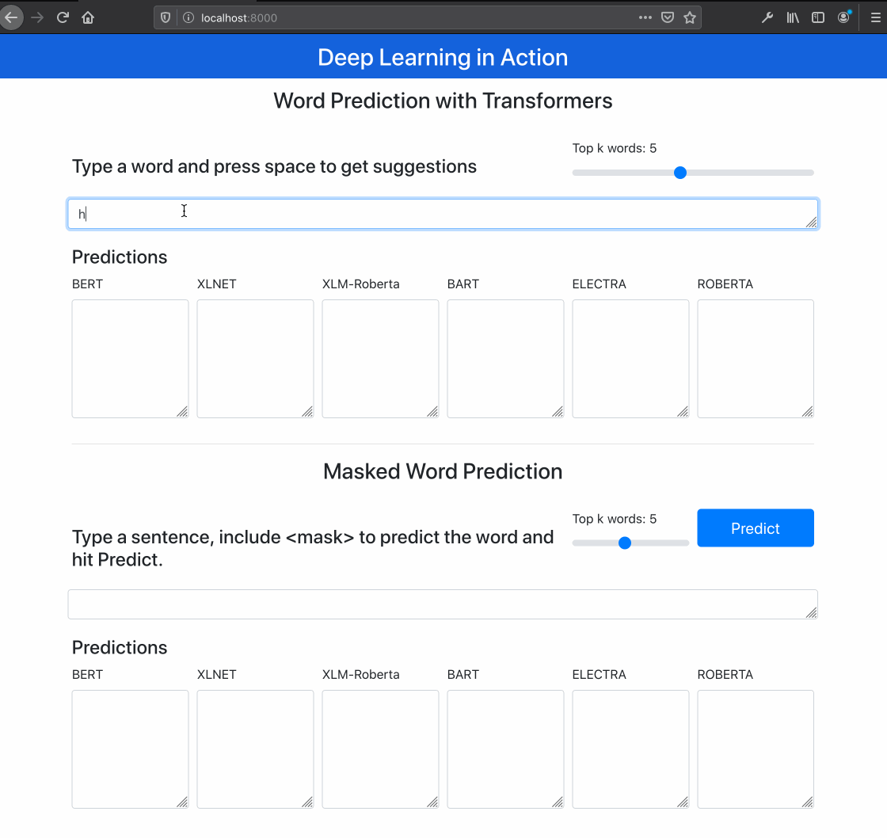

# Next word prediction
Simple application using transformers models to predict next word or a masked word in a sentence.

The purpose is to demo and compare the main models available up to date.

The first load take a long time since the application will download all the models. Beside 6 models running, inference time is acceptable even in CPU.

### Application
This app implements two variants of the same task (predict <mask> token). The first one consider the <mask> is at end of the sentence, simulating a prediction of the next word of the sentece.

The second variant is necessary to include a <mask> token where you want the model to predict the word.




### Running 

```
cd web-app
python app.py
```

Open your browser http://localhost:8000


